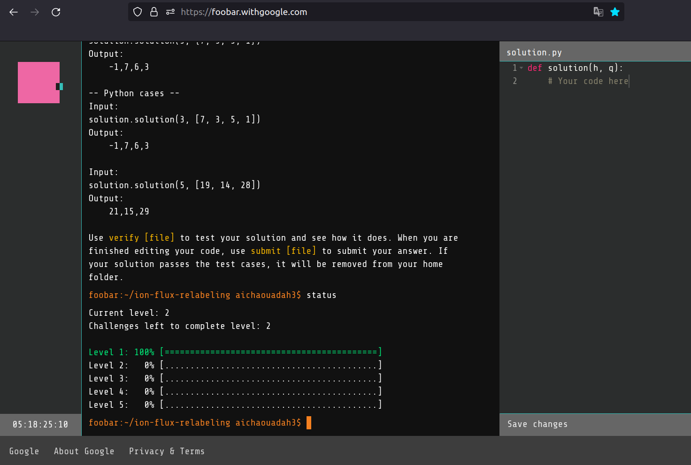

# Google Foobar challenge 2022

Google Foobar challenge is a secret hiring process of Google to recruiting top programmers and developers around the world. This is a way through which they provide direct interviews to the individual who cleared the challenge.

[Link](https://foobar.withgoogle.com/) the challenge is by invitation only!

this challenge has 5 levels, where each level has one or more challenges to solve.

### Level 1 : 
 * Skipping Work
### Level 2 : 
 * Ion Flux Relabeling
 * 
### Level 3 : 
### Level 4 : 
### Level 5 : 
